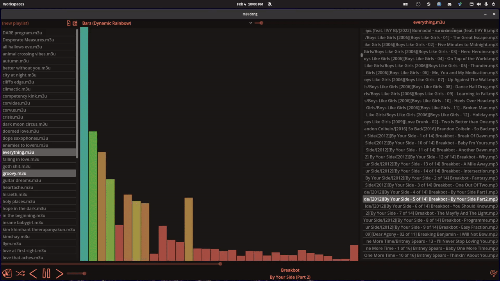
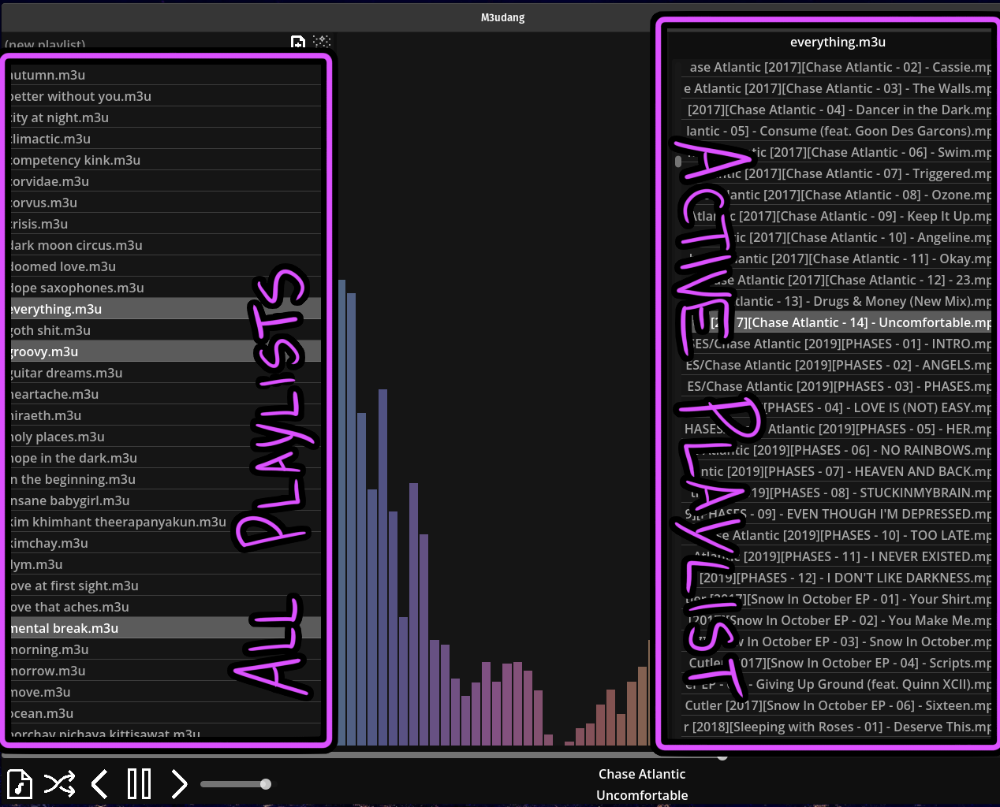

<picture><source media="(prefers-color-scheme: dark)" srcset="packaging/m3udang-white.svg" width="125px"><source media="(prefers-color-scheme: light)" srcset="packaging/m3udang-black.svg" width="125px"></picture>m3udang
=================

An m3u playlist manager. 

  

# Getting started

## Library Setup
m3udang makes several assumptions about the music collection it is playing from:
1. All audio tracks are mp3s
2. All m3u playlists are co-located in one folder
3. All playlists use relative file paths

m3udang will **NOT** modify your audio files in any way. It **WILL** modify your m3u files, so please only run it against copies.

## The basics

Open a playlist using the "Open playlist" button on the bottom left. This will automatically open and begin playing the playlist, and set its parent directory as your playlist directory.

On the right, you will see all the songs in your currently playing playlist, with the currently playing song highlighted.

On the left, you will see all the playlists in your playlist directory. Playlists that contain the current song will be highlighted. Selecting and unselecting a playlist will add or remove the song from that playlist.
